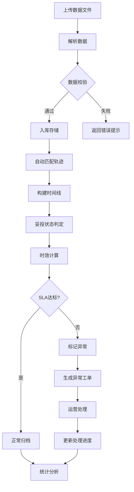

## 1. 产品概述

跨境电商物流订单轨迹追踪系统——面向跨境电商业态的一站式物流履约分析平台，解决多渠道、多承运商物流数据分散、妥投状态难以追踪、时效分析缺乏、异常件处理滞后等核心痛点。
- 目标用户：跨境电商运营团队、物流主管、供应链管理人员
- 核心价值：通过数据导入自动完成履约单妥投分析、时效统计与异常预警，提升物流履约透明度与运营效率

## 2. 核心功能

### 2.1 用户角色

| 角色 | 注册方式 | 核心权限 |
|------|----------|----------|
| 物流运营 | 管理员分配 | 导入数据、查看轨迹、处理异常 |
| 物流主管 | 管理员分配 | 全部运营权限 + 妥投分析、时效报表、异常管理 |
| 管理员 | 系统初始化 | 全部权限 + 系统配置、用户管理 |

### 2.2 功能模块

1. **数据总览页**：核心KPI卡片、妥投率趋势、时效分布、异常概览
2. **订单追踪页**：订单列表、轨迹时间线、状态流转、详情查看
3. **妥投分析页**：妥投率统计、承运商对比、目的地分析、趋势图表
4. **时效统计页**：全链路时效、分段时效、SLA达标率、瓶颈识别
5. **异常处理页**：异常订单列表、异常分类、处理工单、处理进度跟踪

### 2.3 页面详情

| 页面名称 | 模块名称 | 功能描述 |
|----------|----------|----------|
| 数据总览页 | KPI卡片区 | 展示总订单数、妥投率、平均时效、异常件数等核心指标 |
| 数据总览页 | 妥投率趋势图 | 按日/周/月展示妥投率变化趋势 |
| 数据总览页 | 时效分布图 | 展示各时段物流时效分布直方图 |
| 数据总览页 | 异常概览 | 按异常类型分类统计当前异常件数 |
| 数据总览页 | 数据导入 | 支持CSV/Excel文件上传，自动解析物流数据 |
| 订单追踪页 | 筛选搜索栏 | 按订单号、追踪号、承运商、状态、时间范围筛选 |
| 订单追踪页 | 订单列表 | 分页展示订单，支持排序和批量操作 |
| 订单追踪页 | 轨迹时间线 | 展示单个订单的完整物流节点时间线 |
| 订单追踪页 | 状态标签 | 用颜色标签标识订单当前状态（在途/妥投/异常/退回） |
| 妥投分析页 | 妥投率统计 | 按承运商/目的地/时段统计妥投率 |
| 妥投分析页 | 承运商对比 | 多维度对比不同承运商的妥投表现 |
| 妥投分析页 | 目的地分析 | 按国家/地区统计妥投情况热力图 |
| 妥投分析页 | 趋势分析 | 妥投率随时间变化的趋势与预测 |
| 时效统计页 | 全链路时效 | 从发货到妥投的端到端时效统计 |
| 时效统计页 | 分段时效 | 按物流节点分段统计时效（揽收→出境→清关→派送→妥投） |
| 时效统计页 | SLA达标率 | 对比承诺时效与实际时效的达标情况 |
| 时效统计页 | 瓶颈识别 | 自动识别时效最差的环节和路线 |
| 异常处理页 | 异常列表 | 展示所有异常订单，支持筛选和排序 |
| 异常处理页 | 异常分类 | 按类型分类：超时未妥投、清关异常、地址异常、退件、丢失等 |
| 异常处理页 | 处理工单 | 创建和管理异常处理工单，记录处理过程 |
| 异常处理页 | 处理进度 | 跟踪异常件的处理状态和进度 |

## 3. 核心流程

**数据导入→解析→追踪→分析→处理** 主流程：

1. 用户上传物流数据文件（CSV/Excel），系统自动解析并入库
2. 系统根据追踪号自动匹配物流节点，构建完整轨迹时间线
3. 系统自动判断订单妥投状态，计算各环节时效
4. 超出SLA的订单自动标记为异常，生成异常工单
5. 运营人员处理异常，更新处理进度

## 4. 用户界面设计

### 4.1 设计风格

- **主色调**：深海蓝 (#0F172A) + 电光青 (#06D6A0) 强调色，传达专业、可靠、科技感
- **辅助色**：琥珀橙 (#F59E0B) 用于异常警告，珊瑚红 (#EF4444) 用于严重异常，薄荷绿 (#10B981) 用于妥投成功
- **按钮风格**：圆角8px，微阴影，hover时上浮效果
- **字体**：标题使用 DM Sans（粗体），正文使用 Noto Sans SC（中文优先）
- **布局风格**：左侧固定导航栏 + 右侧内容区，卡片式布局，数据可视化优先
- **图标风格**：线性图标，2px描边，与主色调统一

### 4.2 页面设计概览

| 页面名称 | 模块名称 | UI元素 |
|----------|----------|--------|
| 数据总览页 | KPI卡片区 | 深色卡片，大号数字，趋势箭头，渐变边框 |
| 数据总览页 | 妥投率趋势图 | 面积图，渐变填充，交互式tooltip |
| 数据总览页 | 时效分布图 | 柱状图，颜色分段，hover高亮 |
| 数据总览页 | 异常概览 | 环形图，分类色块，点击下钻 |
| 数据总览页 | 数据导入 | 拖拽上传区，虚线边框，上传进度条 |
| 订单追踪页 | 筛选搜索栏 | 多条件筛选器，搜索框带图标 |
| 订单追踪页 | 订单列表 | 表格，状态标签色块，行hover效果 |
| 订单追踪页 | 轨迹时间线 | 垂直时间线，节点图标，连接线动画 |
| 妥投分析页 | 妥投率统计 | 多维数据表，条件格式化 |
| 妥投分析页 | 承运商对比 | 雷达图/分组柱状图 |
| 妥投分析页 | 目的地分析 | 地图热力图或色块矩阵 |
| 时效统计页 | 全链路时效 | 瀑布图/漏斗图 |
| 时效统计页 | 分段时效 | 甘特图风格，节点间连线 |
| 时效统计页 | SLA达标率 | 仪表盘/进度环 |
| 异常处理页 | 异常列表 | 表格，异常类型色标，紧急度排序 |
| 异常处理页 | 处理工单 | 侧滑面板，表单输入，状态流转 |

### 4.3 响应式设计

- 桌面优先设计，最小宽度1280px
- 平板端（768-1280px）：侧边栏折叠为图标模式，图表自适应缩放
- 移动端（<768px）：底部导航，卡片堆叠，简化图表

### 4.4 3D场景指导

不适用
