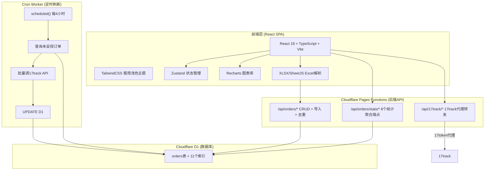

## 1. 架构设计



## 2. 技术栈

| 层级 | 技术 | 说明 |
|------|------|------|
| 前端框架 | React 18 + TypeScript + Vite | SPA，Vite构建 |
| 样式 | TailwindCSS 3 | 极简白色浅蓝配色 |
| 图表 | Recharts | 饼图/柱状图/面积图/热力矩阵 |
| 状态管理 | Zustand + persist | 监控规则/承运商映射持久化到localStorage |
| 日期 | dayjs | 轻量日期处理 |
| 图标 | Lucide React | 线性图标 |
| Excel解析 | XLSX (SheetJS) | 履约单导入 |
| 后端API | Cloudflare Pages Functions | /functions/api/ 下的服务端函数 |
| 数据库 | Cloudflare D1 | SQLite，服务端SQL聚合 |
| 定时任务 | Cloudflare Worker Cron Trigger | 每4小时自动刷新轨迹 |
| CI/CD | GitHub Actions | test→预览，main→生产 |
| 部署 | Cloudflare Pages | 零服务器费用 |

## 3. 路由定义

| 路由 | 页面 | 功能 |
|------|------|------|
| `/` | Dashboard | 数据总览，KPI+状态分布+承运商/目的地统计 |
| `/tracking` | Tracking | 轨迹追踪，订单列表+轨迹时间线+17track拉取 |
| `/delivery` | DeliveryDashboard | 妥投分析，P90矩阵+时效分布+SLA趋势 |
| `/exceptions` | Exceptions | 异常处理，9种状态卡片+子状态订单列表 |
| `/fulfillment` | FulfillmentMonitor | 履约监控，6条规则+告警列表 |
| `/settings/carrier` | CarrierSettings | 运输商管理，C端物流商↔17track映射 |
| `/settings/api` | ApiSettings | API管理，17track密钥配置 |
| `/settings/data` | DataSourceSettings | 数据源管理，履约单导入 |
| `/settings/sla` | SlaSettings | SLA配置 |
| `/settings/other` | OtherSettings | 其他管理，清空数据+去重 |

## 4. API端点

### 4.1 订单CRUD

| 方法 | 路径 | 功能 |
|------|------|------|
| GET | `/api/orders` | 分页查询订单（支持status/country/carrier/warehouse/team/search/timeField筛选） |
| POST | `/api/orders` | 批量upsert订单（INSERT ON CONFLICT） |
| DELETE | `/api/orders/:id` | 删除单个订单 |
| POST | `/api/orders/import` | 履约单导入（XLSX解析后调用） |
| POST | `/api/orders/clear` | 清空所有订单（分批DELETE+验证） |
| GET | `/api/orders/count` | 订单总数 |
| GET | `/api/orders/filters` | 筛选选项（国家/承运商/仓库/团队列表） |
| GET | `/api/orders/tracking-list` | 追踪号列表（用于17track批量查询） |
| POST | `/api/orders/lookup` | 批量按追踪号/订单号查询 |
| POST | `/api/orders/dedup` | 数据去重（清理旧格式+合并同号） |
| GET | `/api/orders/migrate` | 手动触发数据库迁移 |

### 4.2 统计聚合

| 路径 | 功能 |
|------|------|
| `/api/orders/stats/kpi` | KPI指标（总数/妥投率/时效/异常/SLA） |
| `/api/orders/stats/status-distribution` | 状态分布（主状态+子状态计数） |
| `/api/orders/stats/by-carrier` | 按承运商统计 |
| `/api/orders/stats/by-country` | 按目的地统计 |
| `/api/orders/stats/p90-matrix` | P90时效矩阵（承运商×目的地） |
| `/api/orders/stats/transit-distribution` | 时效分布（分段统计） |
| `/api/orders/stats/sla-trend` | SLA达标率趋势 |
| `/api/orders/stats/carrier-p90` | 承运商P90时效 |
| `/api/orders/stats/monitoring-alerts` | 履约监控告警 |

### 4.3 17track代理

| 方法 | 路径 | 功能 |
|------|------|------|
| POST | `/api/17track/gettrackinfo` | 获取轨迹详情 |
| POST | `/api/17track/getrealtimetrackinfo` | 获取实时轨迹 |
| POST | `/api/17track/stop` | 停止追踪 |
| POST | `/api/17track/delete` | 删除追踪 |
| POST | `/api/17track/retrack` | 重新追踪 |
| POST | `/api/17track/test` | 测试API连接 |

17token传递：前端localStorage存API key → 请求Header带17token → 后端优先用客户端token，回退用环境变量。

## 5. 数据模型

### 5.1 D1 Schema

```sql
CREATE TABLE orders (
  id TEXT PRIMARY KEY,                    -- TN-{trackingNumber}
  order_id TEXT NOT NULL,
  tracking_number TEXT NOT NULL,
  carrier TEXT DEFAULT '',                 -- C端物流商名（已映射）
  carrier_code INTEGER,                   -- 17track承运商代码
  origin TEXT DEFAULT '',
  destination TEXT DEFAULT '',
  destination_country TEXT DEFAULT '',     -- 目的地（统一字段）
  status TEXT NOT NULL DEFAULT 'not_found',
  sub_status TEXT DEFAULT '',
  ship_date TEXT DEFAULT '',
  delivery_date TEXT DEFAULT '',
  actual_days REAL,
  sla_days REAL DEFAULT 20,
  exception_description TEXT DEFAULT '',
  erp_order_no TEXT DEFAULT '',
  erp_created_at TEXT DEFAULT '',
  erp_shipped_at TEXT DEFAULT '',
  erp_warehouse TEXT DEFAULT '',           -- 仓库（统一字段）
  erp_team TEXT DEFAULT '',
  erp_warehouse_code TEXT DEFAULT '',
  erp_platform TEXT DEFAULT '',
  erp_shipping_qty INTEGER DEFAULT 0,
  erp_payment_time TEXT DEFAULT '',
  erp_packing_time TEXT DEFAULT '',
  erp_checkout_time TEXT DEFAULT '',
  erp_logistics_provider TEXT DEFAULT '',
  erp_logistics_provider_display TEXT DEFAULT '',
  erp_current_channel TEXT DEFAULT '',
  sync_meta TEXT DEFAULT '{}',             -- JSON: {source, lastSyncAt, carrierCode}
  events TEXT DEFAULT '[]',                -- JSON: TrackingEvent[]
  created_at TEXT DEFAULT (datetime('now')),
  updated_at TEXT DEFAULT (datetime('now'))
);
```

### 5.2 前端数据类型

```typescript
interface LogisticsOrder {
  orderId: string
  trackingNumber: string
  carrier: string
  origin: string
  destination: string
  destinationCountry: string
  status: OrderStatus
  subStatus: string
  shipDate: string
  deliveryDate: string
  slaDays: number
  actualDays: number | null
  events: TrackingEvent[]
  exception?: ExceptionInfo
  erpInfo?: ErpInfo
  syncMeta?: SyncMeta
}

type OrderStatus =
  | 'not_found' | 'info_received' | 'in_transit' | 'expired'
  | 'available_for_pickup' | 'out_for_delivery' | 'delivery_failure'
  | 'delivered' | 'exception'

type EventPhase =
  | 'info' | 'pickup' | 'export' | 'customs' | 'transit'
  | 'arrival' | 'delivery' | 'delivered' | 'pickup_point'

interface TrackingEvent {
  timestamp: string
  location: string
  status: string
  subStatus: string
  description: string
  phase: EventPhase
}
```

## 6. 关键业务逻辑

### 6.1 上网时间判断

优先级：17track子状态 > 关键字匹配

```
1. 查找 subStatus === 'InTransit_PickedUp' 的事件 → 取其timestamp
2. 无匹配 → 在轨迹描述中搜索关键字（pick up/揽收/collected等）
3. 仍无匹配 → 返回null
```

### 6.2 承运商映射

```
17track返回carrier_code → 查carriers.json获取17track承运商名
→ resolveCarrierName() 查映射表 → 转换为C端物流商名
```

### 6.3 妥投率计算

```
妥投率 = deliveredOrders / validOrders
validOrders = totalOrders - notFoundOrders（排除查询不到）
```

### 6.4 Upsert逻辑

```
INSERT ON CONFLICT(id) DO UPDATE SET
  - 非空字段覆盖旧值（CASE WHEN excluded.xxx != '' THEN excluded.xxx ELSE orders.xxx）
  - status/events/sync_meta 始终覆盖
  - erp字段与17track字段互不覆盖（各取各的）
```

## 7. Cron Worker

| 配置 | 值 |
|------|-----|
| 名称 | logistics-tracker-cron |
| 触发 | `0 */4 * * *`（每4小时） |
| D1绑定 | DB（与Pages共享同一数据库） |
| Secret | TRACK17_API_KEY |

流程：
1. `SELECT tracking_number, carrier_code FROM orders WHERE status != 'delivered' AND status != 'not_found' ORDER BY updated_at ASC LIMIT 100`
2. 按40个/批调用17track `gettrackinfo`
3. 解析status/sub_status/events/carrier
4. `db.batch()` 批量UPDATE
5. 妥投订单自动停刷

手动触发：`POST /refresh?limit=N`（N范围1-500）

## 8. 部署流程

```
git push origin test  → GitHub Actions → npm ci → npm run build
  → npx wrangler pages deploy dist --project-name=logistics-tracker --branch=test

git push origin main → GitHub Actions → npm ci → npm run build
  → npx wrangler pages deploy dist --project-name=logistics-tracker --branch=main
```

Cron Worker需单独部署：
```bash
cd cron-worker
npx wrangler secret put TRACK17_API_KEY
npx wrangler deploy
```
