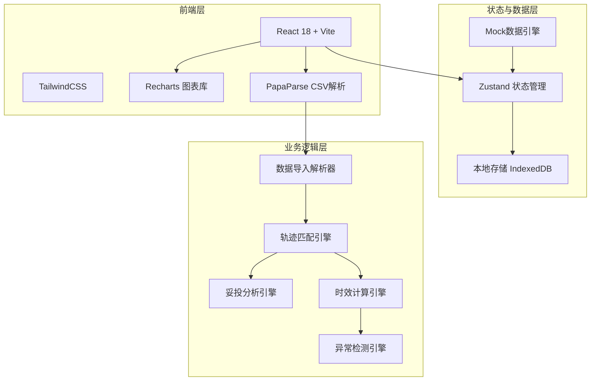
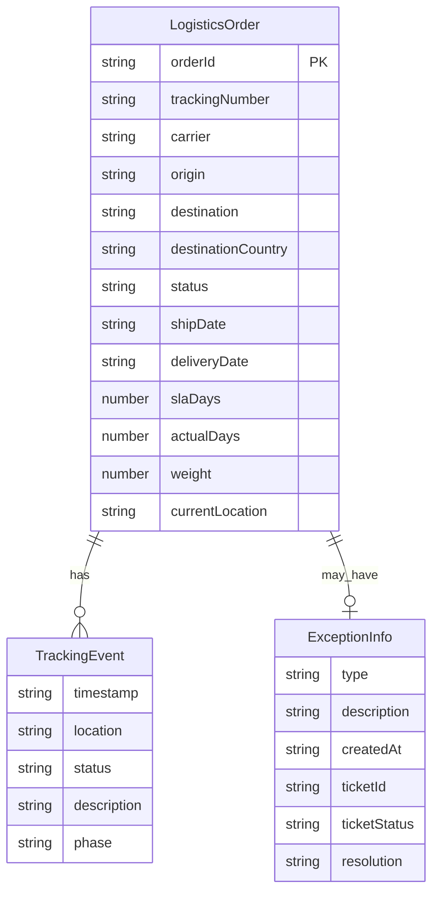

## 1. 架构设计



## 2. 技术说明

- **前端框架**：React@18 + TypeScript + Vite
- **样式方案**：TailwindCSS@3 + CSS Variables（主题色）
- **图表库**：Recharts（轻量、React原生支持）
- **数据解析**：PapaParse（CSV解析）+ XLSX（Excel解析）
- **状态管理**：Zustand（轻量、无boilerplate）
- **路由**：React Router v6
- **数据存储**：浏览器本地（localStorage + 内存），无后端依赖
- **日期处理**：dayjs
- **图标**：Lucide React
- **初始化工具**：Vite init

## 3. 路由定义

| 路由 | 用途 |
|------|------|
| `/` | 数据总览页，展示核心KPI和图表 |
| `/tracking` | 订单追踪页，订单列表和轨迹时间线 |
| `/delivery` | 妥投分析页，妥投率统计和对比分析 |
| `/timeliness` | 时效统计页，全链路和分段时效分析 |
| `/exceptions` | 异常处理页，异常订单管理和工单处理 |

## 4. API定义

本项目为纯前端应用，无后端API。数据通过文件导入或内置Mock数据生成。

### 4.1 核心数据类型

```typescript
interface LogisticsOrder {
  orderId: string;
  trackingNumber: string;
  carrier: string;
  origin: string;
  destination: string;
  destinationCountry: string;
  status: 'in_transit' | 'delivered' | 'exception' | 'returned';
  shipDate: string;
  deliveryDate?: string;
  slaDays: number;
  actualDays?: number;
  weight: number;
  currentLocation: string;
  events: TrackingEvent[];
  exception?: ExceptionInfo;
}

interface TrackingEvent {
  timestamp: string;
  location: string;
  status: string;
  description: string;
  phase: 'pickup' | 'export' | 'customs' | 'transit' | 'delivery' | 'delivered';
}

interface ExceptionInfo {
  type: 'timeout' | 'customs' | 'address' | 'return' | 'lost' | 'damaged';
  description: string;
  createdAt: string;
  ticketId?: string;
  ticketStatus?: 'pending' | 'processing' | 'resolved';
  resolution?: string;
}

interface DeliveryAnalysis {
  totalOrders: number;
  deliveredCount: number;
  deliveryRate: number;
  byCarrier: Record<string, { total: number; delivered: number; rate: number }>;
  byDestination: Record<string, { total: number; delivered: number; rate: number }>;
  trend: Array<{ date: string; rate: number }>;
}

interface TimelinessAnalysis {
  avgDays: number;
  medianDays: number;
  p90Days: number;
  slaComplianceRate: number;
  byPhase: Record<string, { avgHours: number; medianHours: number }>;
  byCarrier: Record<string, { avgDays: number; slaRate: number }>;
  distribution: Array<{ range: string; count: number }>;
}
```

## 5. 服务器架构图

不适用（纯前端应用，无后端服务）

## 6. 数据模型

### 6.1 数据模型定义



### 6.2 数据定义

本项目使用前端内存数据 + localStorage持久化，无需DDL语句。数据通过以下方式初始化：

1. **Mock数据生成器**：内置数据生成函数，模拟200+条跨境物流订单
2. **CSV导入**：支持标准物流报表CSV格式导入
3. **Excel导入**：支持.xlsx/.xls格式导入

Mock数据覆盖的承运商：DHL、FedEx、UPS、EMS、云途、递四方
Mock数据覆盖的目的地：美国、英国、德国、法国、日本、澳大利亚、加拿大、巴西
